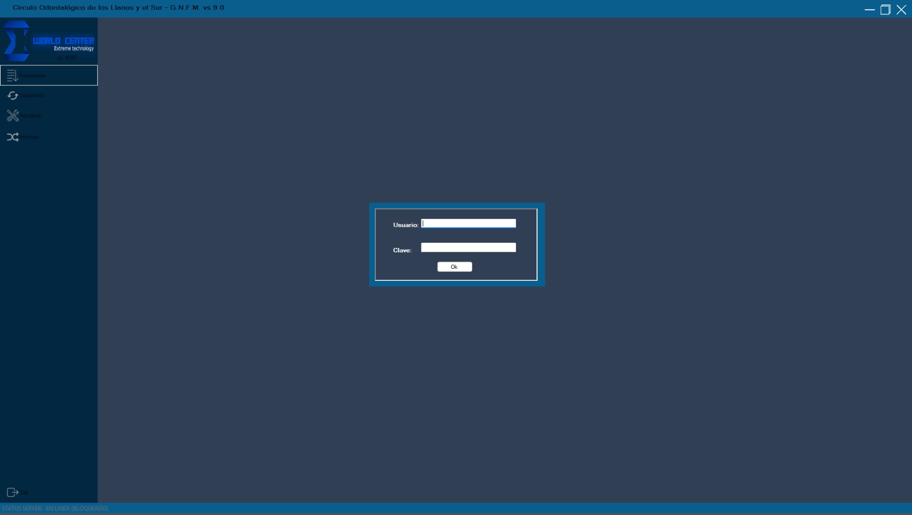
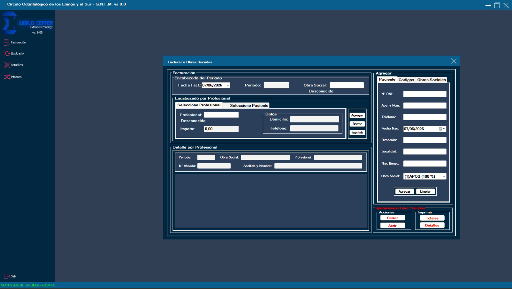
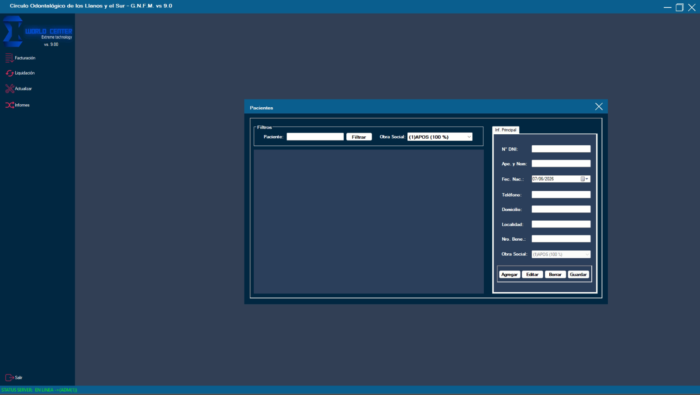
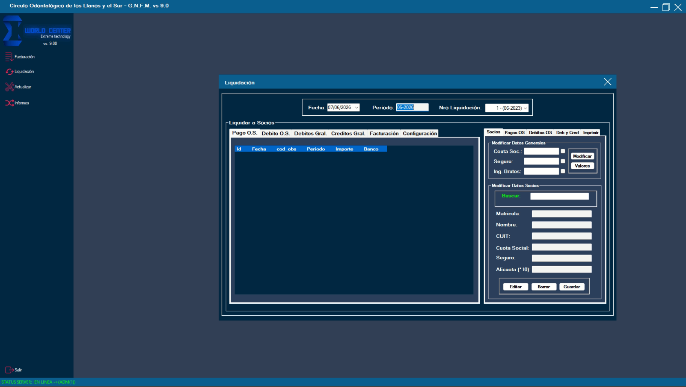
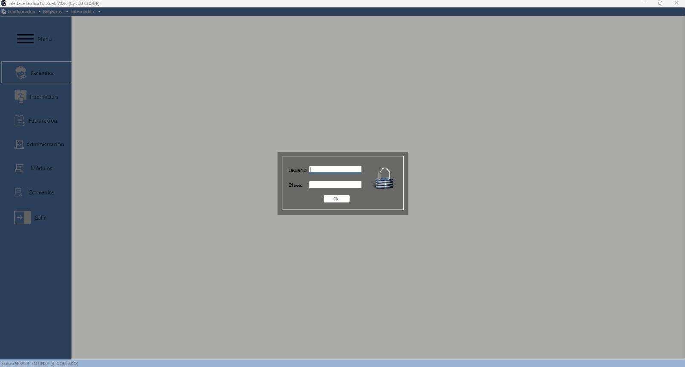
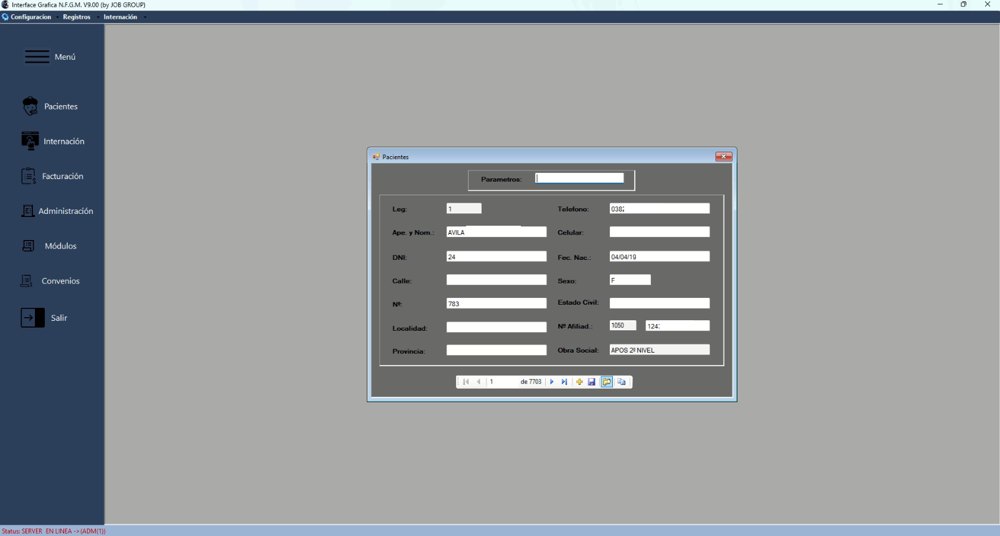
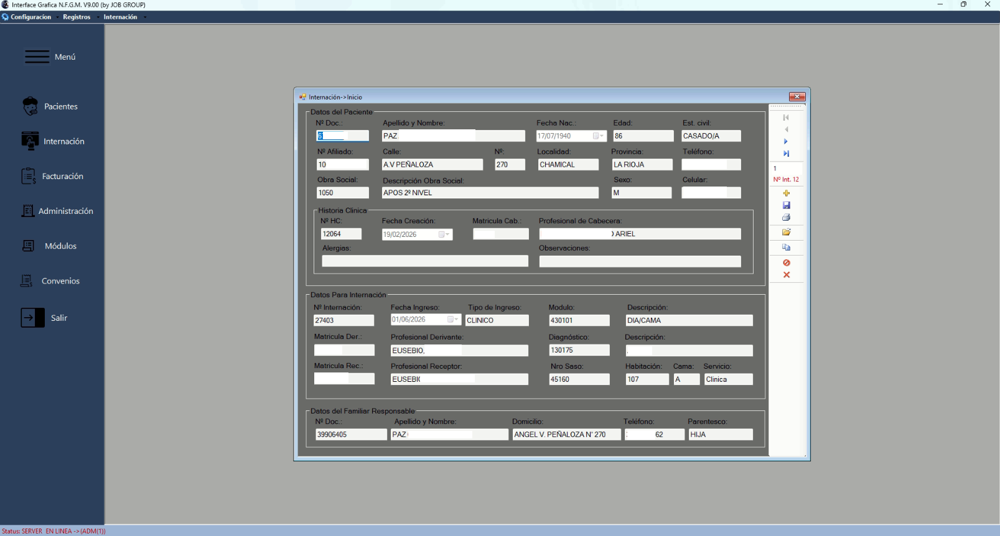
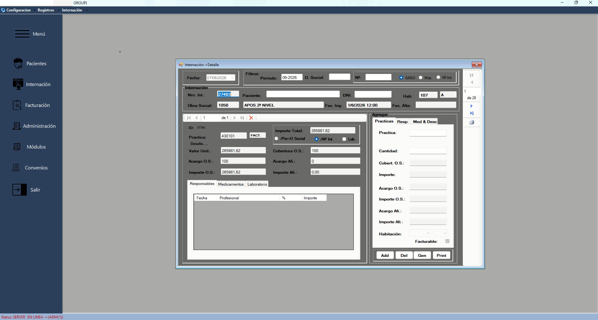

# 🏥 Healthcare Software Portfolio

> Portfolio de sistemas de gestión para el sector salud desarrollados en C# con arquitectura de 4 capas y SQL Server. Más de 15 años de desarrollo y mantenimiento en producción real en La Rioja, Argentina.

**Desarrollador:** Cristian Tomas Britos · Licenciado en Análisis de Sistemas · Docente UNLaR  
🔗 [linkedin.com/in/cristiantbritos](https://linkedin.com/in/cristiantbritos) · 📧 cbritos@unlar.edu.ar

---

## 📁 Proyectos en este repositorio

| Proyecto | Cliente | Stack | Estado |
|---|---|---|---|
| [🦷 Sistema Odontológico](#-gnfm--sistema-para-círculos-odontológicos) | Círculo Odontológico de los Llanos y el Sur | C# · SQL Server · 4 capas | ✅ Producción v9.0 |
| [🏥 Sistema de Clínica](#-nfgm--sistema-para-clínica-de-segundo-nivel) | Clínica privada de segundo nivel | C# · SQL Server · 4 capas | ✅ Producción v9.0 |

---

## 🦷 G.N.F.M. — Sistema para Círculos Odontológicos

Sistema de escritorio para la gestión integral de facturación, liquidación de socios y administración de pacientes en organizaciones odontológicas.

### Funcionalidades principales
- Facturación a obras sociales por período y profesional
- Liquidación mensual de socios con cálculo de cuota, seguro e ingresos brutos
- Gestión de pacientes con obra social y número de beneficiario
- Informes y comprobantes imprimibles
- Control de sesión por usuario con estado de servidor en tiempo real

### Capturas
| Login | Facturación | Pacientes | Liquidación |
|---|---|---|---|
|  |  |  |  |

---

## 🏥 N.F.G.M. — Sistema para Clínica de Segundo Nivel

Sistema de escritorio para la gestión integral de internación, facturación y administración de pacientes en establecimientos de salud de segundo nivel de complejidad.

### Funcionalidades principales
- Internación completa: ingreso, habitación, cama, servicio y diagnóstico CIE-10
- Historia clínica con médico de cabecera, alergias y familiar responsable
- Registro de prácticas facturables por internación (prácticas, medicamentos, laboratorio)
- Cálculo automático de cobertura OS e importe a cargo del afiliado
- Facturación por obra social con soporte multi-convenio
- Gestión de más de 7.000 pacientes en producción
- Módulos de Administración, Convenios y Configuración

### Capturas
> ⚠️ Las capturas utilizan datos ficticios generados para demo.

| Login | Pacientes | Internación | Detalle de Prácticas |
|---|---|---|---|
|  |  |  |  |

---

## 🏗️ Arquitectura compartida

Ambos sistemas implementan la misma **arquitectura de 4 capas**:

```
┌──────────────────────────────────────────┐
│         CAPA DE PRESENTACIÓN             │  Windows Forms (C#)
├──────────────────────────────────────────┤
│          CAPA DE NEGOCIO                 │  Reglas, validaciones, cálculos
├──────────────────────────────────────────┤
│       CAPA DE ACCESO A DATOS             │  ADO.NET + Stored Procedures
├──────────────────────────────────────────┤
│        CAPA DE BASE DE DATOS             │  Microsoft SQL Server
└──────────────────────────────────────────┘
         ↕ Cliente-Servidor en red local
```

---

## ⚙️ Stack tecnológico

| Componente | Tecnología |
|---|---|
| Lenguaje | C# (.NET Framework 4.x) |
| UI | Windows Forms |
| Base de datos | Microsoft SQL Server |
| Acceso a datos | ADO.NET + Stored Procedures |
| Despliegue | Cliente-Servidor en red local |
| Autenticación | Login por usuario/clave con control de sesión |

---

## 🗂️ Estructura del repositorio

```
📦 healthcare-software-portfolio
 ┣ 📂 odontologico/
 ┃ ┣ 📂 src/
 ┃ ┃ ┣ 📂 Presentacion/
 ┃ ┃ ┣ 📂 Negocio/
 ┃ ┃ ┣ 📂 AccesoDatos/
 ┃ ┃ ┗ 📂 Entidades/
 ┃ ┣ 📂 BaseDatos/
 ┃ ┃ ┣ 📜 schema.sql
 ┃ ┃ ┣ 📜 stored_procedures.sql
 ┃ ┃ ┗ 📜 datos_demo.sql
 ┃ ┣ 📂 screenshots/
 ┃ ┗ 📜 README.md
 ┣ 📂 clinica/
 ┃ ┣ 📂 src/
 ┃ ┃ ┣ 📂 Presentacion/
 ┃ ┃ ┣ 📂 Negocio/
 ┃ ┃ ┣ 📂 AccesoDatos/
 ┃ ┃ ┗ 📂 Entidades/
 ┃ ┣ 📂 BaseDatos/
 ┃ ┃ ┣ 📜 schema.sql
 ┃ ┃ ┣ 📜 stored_procedures.sql
 ┃ ┃ ┗ 📜 datos_demo.sql
 ┃ ┣ 📂 screenshots/
 ┃ ┗ 📜 README.md
 ┣ 📜 .gitignore
 ┣ 📜 config.example
 ┗ 📜 README.md          ← este archivo
```

---

## 🔐 Nota sobre privacidad y datos

Ambos proyectos son **Portfolio Editions** de sistemas en producción real. Todo el código se publica sin datos reales de pacientes ni credenciales de conexión. Las capturas utilizan registros ficticios generados exclusivamente para este repositorio.

Los sistemas en producción manejan datos sensibles de salud y cumplen con los requisitos de confidencialidad establecidos por cada institución cliente.

---

## 📬 Contacto

**Cristian Tomas Britos**  
Licenciado en Análisis de Sistemas · Docente UNLaR · Director de investigación INDELLaR  
📧 cbritos@unlar.edu.ar  
🔗 [linkedin.com/in/cristiantbritos](https://linkedin.com/in/cristiantbritos)  
💻 [github.com/cristianbritos](https://github.com/cristianbritos)

---

> *Sistemas desarrollados y mantenidos desde 2009. Versión actual 9.0, resultado de más de 15 años de iteración continua basada en necesidades reales del sector salud en La Rioja, Argentina.*
